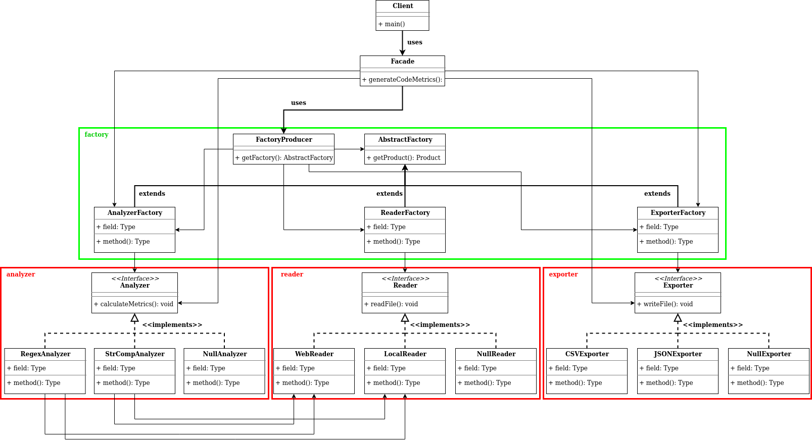

# Source Code Analyzer

## Execution Instructions
1. Build the executable Java application with: 
	mvn package jacoco:report

2. Run the executable by executing
	java –jar “jar-with-dependencies” arg0 arg1 arg2 arg3 arg4
were args translate to: 	
	arg0 = “JavaSourceCodeInputFile” (e.g., src/test/resources/TestClass.java)
	arg1 = “sourceCodeAnalyzerType” [regex|strcomp]
	arg2 = “SourceCodeLocationType” [local|web]
	arg3 = “OutputFilePath” (e.g., ../output_metrics_file)
	arg4 = “OutputFileType” [csv|json]
example: 
	java –jar ./target/sourcecodeanalyzer-0.0.1-SNAPSHOT-jar-with-dependencies.jar ./src/test/resources/TestClass.java regex local metrics_results csv

## About the module

In the picture below is the class diagram of the refactored module, which implements software design patterns.

The patterns implemented are:
- Strategy Pattern
- Factory / Abstract Factory Pattern
- Facade Pattern
- Null Object Pattern

### Strategy Pattern

The classes implementing the strategy pattern are:
- **analyzer** package:
: Instead of having only one analyzer class which covers all implementation cases, we have one analyzer class for each type of code analysis we want to conduct.
- **reader** package:
: Instead of having only one reader class which covers all implementation cases, we have one reader class for each type of file location we want to reach.
- **exporter** package:
: Instead of having only one exporter class which covers all implementation cases, we have one exporter class for each type of file we want our data to be saved into.
- **factory** package:
: Instead of having only one factory class which covers all implementation cases, we have one factory class for each category of object we want our factory to create.

The reason for implementing the Strategy Pattern in all of the above cases is that we can very easily extend the variety of algorithms/functions our code support (e.g. new analyzer types, new destination file types etc.)

### Factory / Abstract Factory Pattern
The classes implementing the abstract factory pattern are:
- **factory** package:
: FactoryProducer class, generates a Factory of the desired category. Each category's factory creates the category's object according to the type specified in the parameter. 
- **analyzer** package:
: In this package are to be found the "products" made by an AnalyzerFactory.
- **reader** package:
: In this package are to be found the "products" made by a ReaderFactory.
- **exporter** package:
: In this package are to be found the "products" made by an ExporterFactory.

The main reason for creating the abstract factory and the concrete factories mentioned above is that the client is not involved in the instantiation process of any of these objects. The client only has to provide the parameter.
Also, all objects of all families are created through the same instantiation process. Thus it is very easy to add more of them without writing excess code.

### Facade Pattern
The class implementing the facade pattern is (unsurprisingly) the Facade class. It is the only class that our client needs to communicate with, every other implementation detail is hidden behind it.

This makes the client and the service independent of each other. This way the codeanalyzer package is fully portable without the client. Also, the client is simplified as much as possible.

### Null Object Pattern
The classes implementing the null object pattern are:
- **analyzer** package:
: A NullAnalyzer class is provided, in case the user's input about the analyzer type is not the expected.
- **reader** package:
: A NullReader class is provided, in case the user's input about the file location is not the expected.
- **exporter** package:
: A NullExporter class is provided, in case the user's input about the destination file type is not the expected.

Protects the client from having to handle null or unknown input cases.